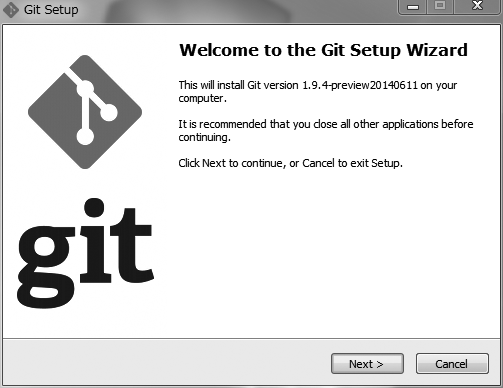
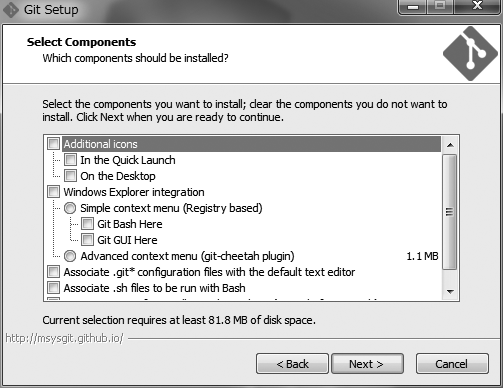
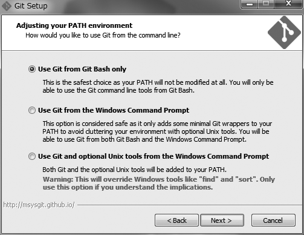
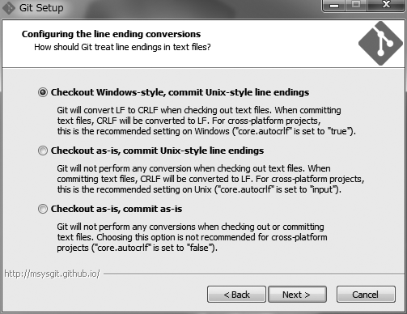
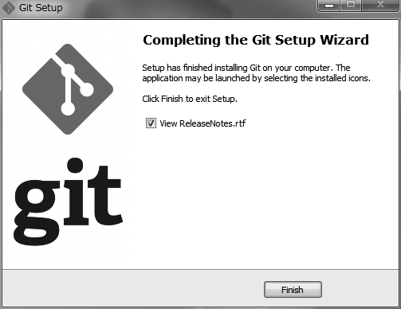
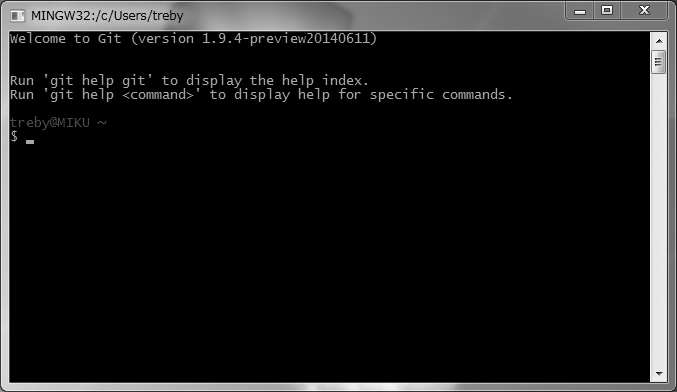

# Getting Started
mac等を利用していると`git`コマンドは標準で使えたりしますが、利用しているOS等によっては改めて導入する必要があるかもしれません。

## Windowsへの導入方法

ここでは参考までにWindowsにgitを導入する方法を紹介します。

まず、下記のURLより実行ファイルをダウンロードしてきます。

```
http://git-scm.com/downloads
```

インストーラを起動します。

[](../assets/git_wizard.png)

使用許諾条件を承諾し、インストールする場所を選択したら、次のような画面になると思います。

[](../assets/git_components.png)

ここでチェックを入れるとクイックランチャーやデスクトップにショートカットが作成されたり、エクスプローラーに機能を統合されたりする(右クリックで使えるようになったりする)ようです。筆者は特に必要を感じませんでしたので、全てのチェックを外しました。

[](../assets/git_environment.png)

ここではGitをどのような環境で使うのかを聞かれます。コマンドプロンプトに組み込むのではなく、明示的に使いたいので「Use Git from Git Bash only」を選択しました。コマンドプロンプトに標準で入れたい場合は「Use Git from the Windows Command Prompt」を選択しても良いかもしれません。

[](../assets/git_conversions.png)

ここでは改行の規則を問われています。OSによって改行コードが異なるのでそれをどう扱うかを設定できるのですね。特に理由がなければデフォルトの「Checkout Windows-style, commit Unix-style line endings」を選択しておくのが無難です。

[](../assets/git_finish.png)

ここまで設定すれば、インストールが行われ導入が完了します。スタートメニューから「Git Bash」を選択すればgitコマンドを試すことができます。

[](../assets/git_bash.png)

なお、冒頭に書いた通り、本書においては筆者のMacbook Airにインストールされているgitを基準とします。WindowsにGitを導入した場合など、GUIベースでgitが使えるようなケースもあるかもしれませんが、基本的にはコマンドラインから直接gitコマンドを実行することを前提とします。

```
% git --version
git version 1.8.5.2 (Apple Git-48)
```
