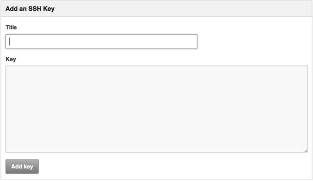
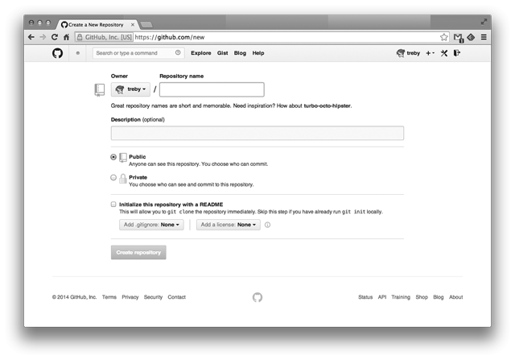

# Getting Started

まず、GitHubのアカウントを作成します。

[](../assets/gh_main.png)

```
https://github.com/treby
```

のような、`https://github.com/<ユーザ名>`があなたのページとなります。


## 公開鍵を登録する
手元のマシンで作業を行い、それをGitHubに反映するためにはリモートリポジトリとなるGitHubとのやり取りに使うための秘密鍵と公開鍵のペアが必要となります。

ここで、秘密鍵と公開鍵のペアの作成方法と、その登録方法を簡単に説明しておきましょう。

まず、ssh-keygenのようなソフトを使い秘密鍵と公開鍵のペアを作成します。鍵のパスワードも忘れずに設定しましょう。

```
% ssh-keygen
Generating public/private rsa key pair.
Enter file in which to save the key (/Users/treby/.ssh/id_rsa): /Users/treby/id_rsa_github
Enter passphrase (empty for no passphrase):
Enter same passphrase again:
Your identification has been saved in /Users/treby/id_rsa_github.
Your public key has been saved in /Users/treby/id_rsa_github.pub.
The key fingerprint is:
...
```

ここで、作成された`/Users/treby/id_rsa_github`が秘密鍵、`/Users/treby/id_rsa_github.pub`が公開鍵のファイルとなります。

ペアの作成が完了したら作成された公開鍵をGitHubに登録しましょう。

GitHubページの右上にあるAccount settingsから、SSH Keysタブを選択し、Add SSH Keyボタンを選択します。

[](../assets/gh_ssh.png)

タイトルは公開鍵を識別できるものなら何でもかまいません。

Keyの欄に先ほど作った公開鍵ファイルの中身を貼付けます。

```
% cat id_rsa_github.pub
ssh-rsa AAAAB3NzaC1yc2EAAAADAQABAAABAQDCDHt+fN/mRNbvJhxpAUKzaurQQ4K+1BD5N1+Mah4aD6u...
```

貼付けたらAdd Keyを選択し、パスワード認証が完了すれば登録が行われます。

ここからはSSHクライアントの設定なのですが、秘密鍵の名前を`id_rsa_github`のようにして手元のマシンに配置します(`.ssh/`以下など)。`.ssh/config`ファイルに次の設定を追加します。

```
Host github
    User            git
    HostName        github.com
    IdentityFile    ~/.ssh/id_rsa_github
```

これでGitHubの自分がアクセスできるリポジトリに対してpushが行えるようになりました。

## プロジェクトを作成する

次は、新しくプロジェクト、すなわちリモートリポジトリとなるリポジトリを作成してみましょう。

画面右上の+アイコンからNew repositoryを選択します。

[](../assets/gh_repository.png)

リポジトリの名前と説明文、アクセス権を設定します。アクセス権に関しては、有料会員でないとPrivateを選択することができないので注意が必要です。

Initialize this repository with a READMEのチェックに関しては通常入れなくて構いませんが、慣れてきたら利用しても良いかもしれません。チェックを入れてリポジトリの作成を行うとREADMEや.gitignoreやLICENCEといった最初のコミットとして作成されます。

さて、空で作成されたリポジトリについてですが既に手元にリポジトリがあるのであれば、手順は簡単で、

```
% git remote add origin git@github.com:treby/c86-git.git
```

と、リモートリポジトリを設定した後に、

```
% git push origin master
```

としてあげればGitHubにリポジトリをあげることができます。
